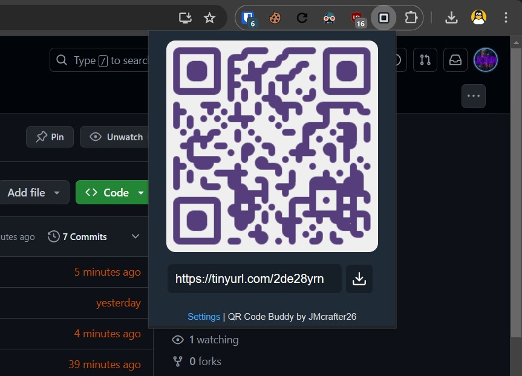
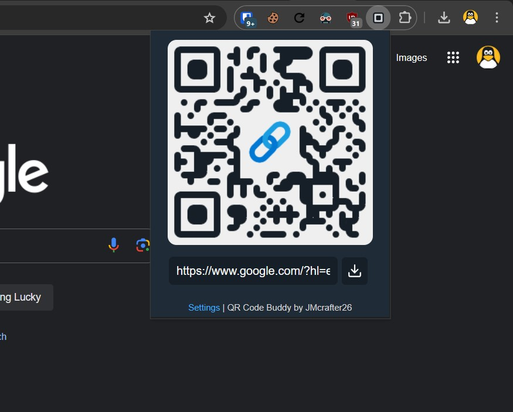
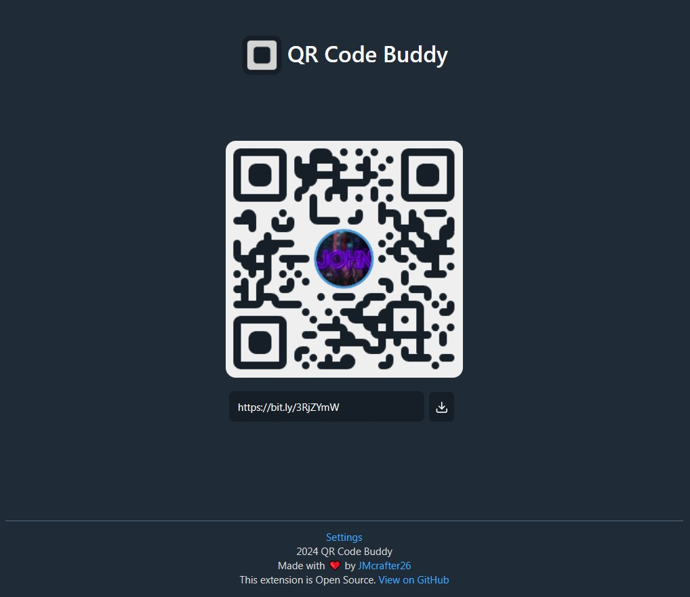
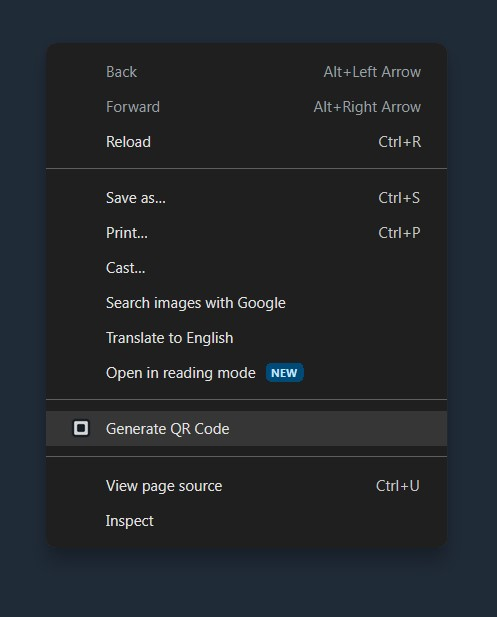

#  QR Code Buddy - Chrome Extension

This is a simple Chrome Extension that generates QR codes for the current tab's URL.

> In development

<!-- Firefox: https://www.extensiontest.com/ -->

## Features

- 💡 Generate QR codes for the current tab's URL
- 📷 Download QR code as image
- 🎨 Customize QR code styling (logo, colors, edge type, ...)
- 🚫 Remove tracking parameters from URL
- 🔗 URL shortening support
- 🖼️ Clean and simple UI
- 🖱️ Generate from context menu
- 🙅‍♂️ No tracking or analytics

## Installation

### From a web store

Coming soon...

<!-- Prepare the extension for publishing and submit it to the web store:

 
-->

### From GitHub

1. [Download the src folder](https://download-directory.github.io/?url=https%3A%2F%2Fgithub.com%2FJMcrafter26%2Fqr-code-buddy-extension%2Ftree%2Fmain%2Fsrc) and extract it to a folder.
2. Open your browser and go to the extensions page:
   - [chrome://extensions/](chrome://extensions/) for Chrome
   - [about:addons](about:addons) for Firefox
   - [edge://extensions/](edge://extensions/) for Edge
   - [opera://extensions/](opera://extensions/) for Opera
3. Enable Developer mode.
4. Click on "Load unpacked" and select the folder where you extracted the files.
5. The extension should now be installed. :tada:

## Usage

It's simple! Just click on the extension icon in the toolbar and the QR code will be generated and displayed on the popup.

But you already knew that, didn't you? (I mean, you're reading the README file, so you must be a pro at this stuff.)

## Screenshots

Click to expand

## Credits and License

This project is licensed under the MIT License. See the [LICENSE](LICENSE) file for details.

- <https://github.com/kozakdenys/qr-code-styling> - MIT License
- <https://github.com/ClearURLs/Addon/> - LGPL-3.0 License
- <https://github.com/feathericons/feather> - MIT License
- <https://github.com/SimGus/chrome-extension-v3-starter> - MIT License
